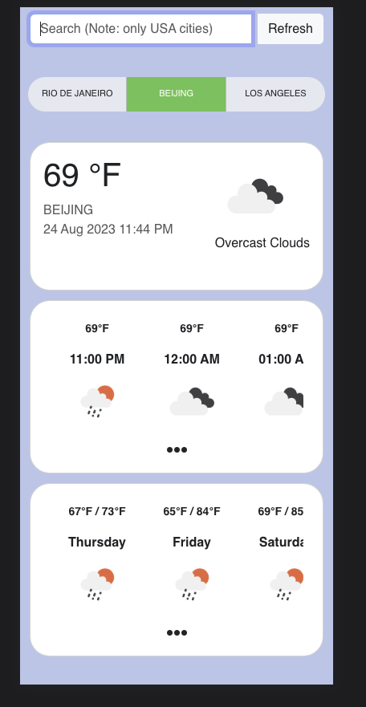
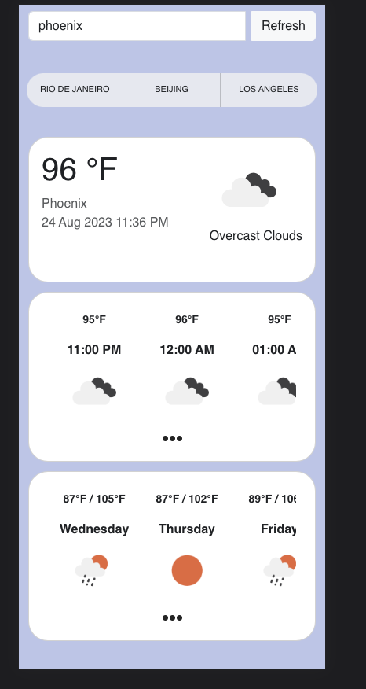
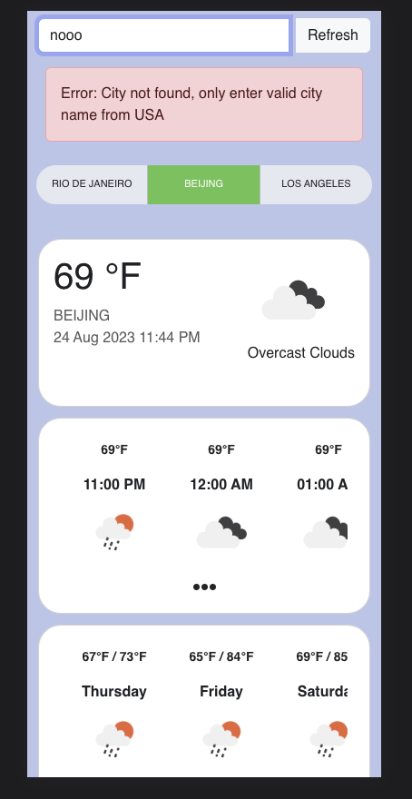

## Test Ria Weather app

## Select city from  tab
<a href="./sc.png" target="_blank"></a>

## Search city from text field
<a href="./sc2.png" target="_blank"></a>

## Invalid city name
<a href="./sc1.png" target="_blank"></a>

You can see a hosted version of `The node.js example app` on <a href="https://the-example-app-nodejs.contentful.com/" target="_blank">Heroku</a>.

## Requirements

* Node 16
* Git

## Common setup

Clone the repo and install the dependencies.

```bash
git clone https://github.com/contentful/the-example-app.nodejs.git
cd ria-weather-code-test
```

```bash
npm install
```


```bash
npm run build
```

## Steps for read-only access

To start the express server, run the following

```bash
npm run preview
```

Open [http://localhost:4173](http://localhost:4173) and take a look around.